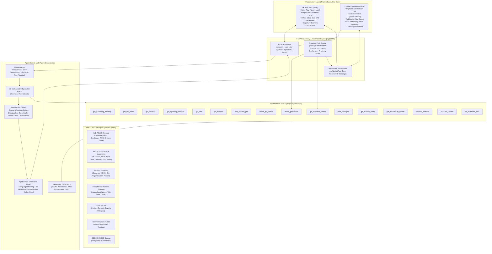
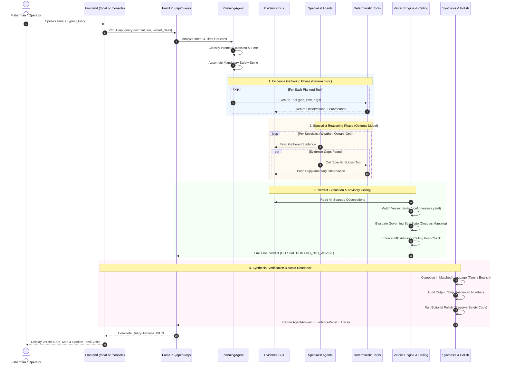
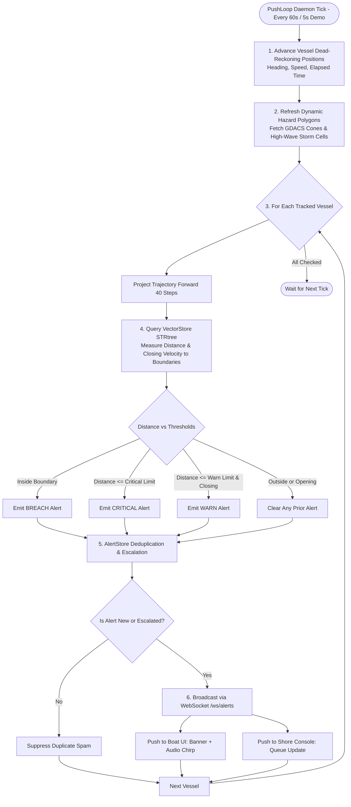

# FORESHORE

<div align="center">

```
  ███████╗ ██████╗ ██████╗ ███████╗███████╗██╗  ██╗ ██████╗ ██████╗ ███████╗
  ██╔════╝██╔═══██╗██╔══██╗██╔════╝██╔════╝██║  ██║██╔═══██╗██╔══██╗██╔════╝
  █████╗  ██║   ██║██████╔╝█████╗  ███████╗███████║██║   ██║██████╔╝█████╗  
  ██╔══╝  ██║   ██║██╔══██╗██╔══╝  ╚════██║██╔══██║██║   ██║██╔══██╗██╔══╝  
  ██║     ╚██████╔╝██║  ██║███████╗███████║██║  ██║╚██████╔╝██║  ██║███████╗
  ╚═╝      ╚═════╝ ╚═╝  ╚═╝╚══════╝╚══════╝╚═╝  ╚═╝ ╚═════╝ ╚═╝  ╚═╝╚══════╝
```

### Marine Foresight for the Small-Boat Fleet

**SIH 2026 Problem Statement SIH26176 · ORCA**  
*Marine EcOsystem Reasoning with Collaborative Agents*  
**Indian Space Research Organisation (ISRO) · Department of Space**  
*Theme: Disaster Management · Category: Software*

[](file:///Users/amish/ForeShore/backend/tests)
[](file:///Users/amish/ForeShore/pyproject.toml)
[](file:///Users/amish/ForeShore/frontend/package.json)
[](file:///Users/amish/ForeShore/frontend/package.json)
[](file:///Users/amish/ForeShore/backend/foreshore/api/main.py)
[](file:///Users/amish/ForeShore/frontend/src/routes/boat/MapView.tsx)
[](file:///Users/amish/ForeShore/backend/foreshore/sources)

---

> **"SAMUDRA tells you what the advisory says. FORESHORE tells you what it means for your boat, tonight, and why."**

</div>

---

## 📑 Table of Contents

- [1. Executive Summary \& Objective](#1-executive-summary--objective)
- [2. The Real Problem \& The SAMUDRA Wedge](#2-the-real-problem--the-samudra-wedge)
- [3. Non-Negotiable Core Invariants](#3-non-negotiable-core-invariants)
- [4. High-Level System Architecture](#4-high-level-system-architecture)
- [5. The 10 Collaborative Specialist Agents](#5-the-10-collaborative-specialist-agents)
- [6. System Workflows \& Data Flow Diagrams](#6-system-workflows--data-flow-diagrams)
  - [6.1 The Request-Response Path](#61-the-request-response-path)
  - [6.2 The Proactive Push \& Alert Loop](#62-the-proactive-push--alert-loop)
  - [6.3 The Deterministic Safety Decision \& Advisory Ceiling](#63-the-deterministic-safety-decision--advisory-ceiling)
  - [6.4 Algorithmic A* Cost-Field Pathfinding](#64-algorithmic-a-cost-field-pathfinding)
- [7. The 16 Deterministic, Provenance-Emitting Tools](#7-the-16-deterministic-provenance-emitting-tools)
- [8. Real-Time Data Ingestion Spine](#8-real-time-data-ingestion-spine)
- [9. Semantically Distinct Geofencing Engine](#9-semantically-distinct-geofencing-engine)
- [10. Dual-Surface User Interfaces](#10-dual-surface-user-interfaces)
  - [10.1 Boat Interface (`/boat`)](#101-boat-interface-boat)
  - [10.2 Shore Control Console (`/console`)](#102-shore-control-console-console)
- [11. Complete Codebase \& Directory Structure](#11-complete-codebase--directory-structure)
- [12. API \& WebSocket Specifications](#12-api--websocket-specifications)
- [13. Quickstart \& Verification Guide](#13-quickstart--verification-guide)

---

## 1. Executive Summary & Objective

**FORESHORE** is an autonomous, agentic marine intelligence and hazard avoidance platform built for small-boat artisanal and motorised fishermen (0–50 nm) operating in the shallow, reef-strewn, geopolitically sensitive waters of **Palk Bay and the Gulf of Mannar** (Rameswaram → Nagapattinam), paired with a shore-side control console for **District Fisheries and Indian Coast Guard** operators.

Built specifically for the **Smart India Hackathon (SIH 2026) Problem Statement SIH26176 ("ORCA")**, submitted by the **Indian Space Research Organisation (ISRO) / Department of Space** under the **Disaster Management** theme.

### Problem Statement Compliance Matrix

The ISRO problem statement outlines **11 mandatory capabilities**. FORESHORE meets all 11:

| # | PS Requirement | Implementation in FORESHORE |
|---|---|---|
| **1** | Natural language intent understanding | `agents/planner.py`: 9 canonical intent classes with deterministic keyword-cues resilient to ASR errors. |
| **2** | Auto-detect language & mirror (Indian regional languages) | `agents/language.py` & `synthesis.py`: Auto-detects 8 Indic scripts; voice-in / voice-out with native Tamil primary support. |
| **3** | Contextual multi-turn dialogue & scenario exploration | `agents/orchestrator.py`: Multi-turn query refinement + dual-epoch departure scenario diffing (`"what if I leave at 04:00 instead of 06:00"`). |
| **4** | Autonomous data discovery, retrieval & integration | `tools/discovery.py` & `sources/`: Ingests and harmonizes 8 public satellite, meteorological, and oceanographic sources on demand. |
| **5** | Spatial, temporal & contextual heterogeneous reasoning | `verdict/engine.py`: Correlates IMD text bulletins, INCOIS 11 km NetCDF grids, Open-Meteo models, and bathymetry without averaging. |
| **6** | Explainable recommendations with maps, charts & advisories | UI Evidence Panel (`EvidencePanel.tsx`): Sourced acquisition time, resolution, freshness, and governing source for every claim. |
| **7** | **Proactive alerts** (weather, high waves, lightning, cyclones) | `push/loop.py`: Background daemon checking vessel tracks every 60s (5s in demo) against dynamic GDACS / IMD hazard polygons. |
| **8** | **Geofencing notifications when approaching boundaries** | `geofence/engine.py`: Proximity and ETA closing vectors computed along track for IMBL, MPAs, and coral habitats; offline via Turf.js. |
| **9** | Route optimization, safe navigation & operational planning | `routing/costfield.py` & `astar.py`: True A* grid routing over wave energy ($H_s^2$), wind, adverse currents, depth, and boundary penalties. |
| **10** | Recommendations with supporting evidence & reasoning traces | `store/traces.py`: Full hierarchical execution tree logged and retrievable via `/api/trace/{id}` with per-step provenances. |
| **11** | Agentic principles (planning, tool selection, collaboration) | `agents/specialists.py`: Hand-rolled orchestration loop over 10 specialist agents with strict tool-subset restrictions. |

---

## 2. The Real Problem & The SAMUDRA Wedge

### The Incumbent: INCOIS SAMUDRA

INCOIS launched the SAMUDRA mobile app in August 2023 (and announced SAMUDRA 2.0) to broadcast Potential Fishing Zones (PFZ) and Ocean State Forecasts (OSF) across coastal languages.

However, **SAMUDRA is a broadcast delivery pipe for precomputed advisories**. It structurally cannot:
1. Correlate multiple conflicting sources to answer arbitrary natural language queries.
2. Evaluate what a weather reading means for a **specific hull type** (1.5m waves are safe for a mechanised trawler, but lethal for a small fibreglass vallam).
3. Compute an optimized navigational path around moving storm cells and shallow coral heads.
4. Answer diagnostic scientific questions (*"Why has fish productivity declined in this bay over the past 5 years?"*).
5. Explain *why* a recommendation was made, or safely refuse to answer when data is expired.

**FORESHORE is the reasoning layer above what SAMUDRA publishes.**

### The Reality at Sea

- **The IMBL Dilemma:** In Palk Bay, the India–Sri Lanka International Maritime Boundary Line (IMBL) is only 12–15 nautical miles from Rameswaram. Drifting across with engine trouble or during night trawling leads to arrest and boat seizure (over 500 fishermen detained in recent years). A simple line on a chart is not enough; fishermen need **predictive ETA warnings** that break through attention.
- **Offshore Connectivity Cliff:** Cellular VHF and 4G networks terminate at 10–15 km offshore. Small boats cannot afford satellite uplinks. FORESHORE is built **offline-first**: geofences, decision envelopes, and routes are cached locally in IndexedDB, and proximity alerts fire client-side from hardware GNSS without a network connection.
- **Wet Hands, Voice Modality:** Typing coordinates on a smartphone at 3:00 AM on a rolling deck is impossible. FORESHORE is voice-first, mirroring Tamil audio with spoken readback.

---

## 3. Non-Negotiable Core Invariants

Enforced in code, not left to LLM prompt adherence. These invariants cannot be violated:

```
                      ┌─────────────────────────────────────────┐
                      │    1. ADVISORY CEILING INVARIANT        │
                      │  FORESHORE can never issue a verdict    │
                      │  more permissive than the governing     │
                      │  IMD Coastal Bulletin for that sector.  │
                      └─────────────────────────────────────────┘
                                           │
                      ┌────────────────────▼────────────────────┐
                      │    2. THREE STRICT VERDICTS ONLY        │
                      │   [GO]  ·  [GO_WITH_CAUTION]  ·         │
                      │            [DO_NOT_ADVISE]              │
                      │  DO_NOT_ADVISE is a designed outcome    │
                      │  guaranteeing a named human handoff.    │
                      └─────────────────────────────────────────┘
                                           │
                      ┌────────────────────▼────────────────────┐
                      │    3. NO UNSOURCED NUMBERS              │
                      │  Every quantitative number must trace   │
                      │  to a typed Observation with verified   │
                      │  Provenance. LLMs cannot invent values. │
                      └─────────────────────────────────────────┘
                                           │
                      ┌────────────────────▼────────────────────┐
                      │    4. SURFACED STALENESS & CONFLICT     │
                      │  Disagreements between IMD, INCOIS and  │
                      │  Open-Meteo are shown side-by-side,     │
                      │  never averaged. Stale data is tagged.  │
                      └─────────────────────────────────────────┘
                                           │
                      ┌────────────────────▼────────────────────┐
                      │    5. DUAL-MODE EXECUTION               │
                      │  FORESHORE_MODE=live (real keyless APIs)│
                      │  FORESHORE_MODE=fixture (frozen demo    │
                      │  snapshot for zero-network resilience). │
                      └─────────────────────────────────────────┘
```

---

## 4. High-Level System Architecture

FORESHORE implements a unified agent core driving two distinct operational surfaces:
- **Boat UI (`/boat`):** Voice-first, high-contrast, mobile PWA in Tamil for small-boat captains at sea.
- **Shore Console (`/console`):** High-density, multi-vessel desktop control room in English for Coast Guard and Fisheries officers.



---

## 5. The 10 Collaborative Specialist Agents

Rather than a generic LLM wrapper, FORESHORE breaks marine problem-solving down into **10 specialist agents** directly matching ISRO's problem statement vocabulary.

Each specialist is governed by an `AgentRuntime` instance operating with a **strictly restricted tool subset**. If an agent attempts to invoke a tool outside its mandate, the runtime blocks it. This guarantees that collaboration is structural rather than simulated.

```
+-----------------------------------------------------------------------------------------------+
|                               10 SPECIALIST AGENTS & TOOL MANDATES                             |
+----------------------+--------------------------------------------+---------------------------+
| Specialist Agent     | Core Responsibility                        | Allowed Tool Subsets      |
+----------------------+--------------------------------------------+---------------------------+
| PlanningAgent        | Intent classification, scenario detection, | Deterministic Planner,    |
|                      | and constructing the ordered PlanStep tree | (All tools via delegation)|
+----------------------+--------------------------------------------+---------------------------+
| MarineDataDiscovery  | Scans catalogues, verifies data coverage,  | [16] list_available_data  |
|                      | spatial resolutions, and update freshness  |                           |
+----------------------+--------------------------------------------+---------------------------+
| WeatherIntelligence  | Monitors winds, gusts, visibility, IMD     | [3] get_weather           |
|                      | lightning nowcasts, and cyclone warnings   | [4] get_lightning_nowcast |
|                      |                                            | [12] get_hazard_alerts    |
+----------------------+--------------------------------------------+---------------------------+
| OceanAnalytics       | Evaluates wave models (INCOIS vs OM), tide,| [2] get_sea_state         |
|                      | currents, chlorophyll/SST front derivation,| [5] get_tide              |
|                      | and multi-year ecological diagnostics      | [6] get_currents          |
|                      |                                            | [8] derive_pfz_zones      |
|                      |                                            | [13] get_productivity_hist|
+----------------------+--------------------------------------------+---------------------------+
| GeospatialReasoning  | Official PFZ line discovery, multi-class   | [7] find_nearest_pfz      |
|                      | geofence checks, exclusion polygon queries,| [9] check_geofences       |
|                      | and nearest shelter landing centres        | [10] get_exclusion_zones  |
|                      |                                            | [14] nearest_harbour      |
+----------------------+--------------------------------------------+---------------------------+
| RiskAssessment       | Analyzes governing coastal bulletins, maps | [1] get_governing_advisory|
|                      | Douglas sea states, checks vessel limits,  | [15] evaluate_verdict     |
|                      | and applies the advisory ceiling           |                           |
+----------------------+--------------------------------------------+---------------------------+
| RoutingAgent         | Dispatches A* pathfinding over weighted    | [10] get_exclusion_zones  |
|                      | nautical cost fields and explains legs     | [11] plan_route           |
+----------------------+--------------------------------------------+---------------------------+
| VisualizationAgent   | Computes optimal map bounding boxes, layer | [7] find_nearest_pfz      |
|                      | visibility, and rendering geometries       | [9] check_geofences       |
|                      |                                            | [10] get_exclusion_zones  |
+----------------------+--------------------------------------------+---------------------------+
| ReportingAgent       | Formats structured situational reports for | [1] get_governing_advisory|
|                      | Coast Guard and Fisheries operators        | [12] get_hazard_alerts    |
|                      |                                            | [14] nearest_harbour      |
+----------------------+--------------------------------------------+---------------------------+
| UserInteraction /    | Inbound Indic script detection, synthesis  | Presentation Layer,       |
| Synthesis Layer      | in matched language, unsourced-number      | No-Unsourced-Numbers      |
|                      | scrubbing, and safety editorial polish     | Verification Pass         |
+----------------------+--------------------------------------------+---------------------------+
```

---

## 6. System Workflows & Data Flow Diagrams

### 6.1 The Request-Response Path



### 6.2 The Proactive Push & Alert Loop

PS Requirements 7 & 8 mandate proactive alerting when adverse weather or boundary approach occurs. A pure request-response system fails this. FORESHORE operates a dedicated background daemon:



### 6.3 The Deterministic Safety Decision & Advisory Ceiling

```mermaid
flowchart TD
    In([Gathered Evidence Bus]) --> Extract[Extract Wave, Wind, Swell, Gusts, Currents]
    Extract --> VLookup[Look Up Vessel Class Limits<br/>config/vessels.yaml]
    
    subgraph Baseline ["Deterministic Baseline Engine"]
        VLookup --> CheckWave{Wave Height > Limit?}
        CheckWave -- Yes --> SetCaution1[Cap at GO_WITH_CAUTION / DO_NOT_ADVISE]
        CheckWave -- No --> CheckSteep{Steepness Hs/1.56Tp² > 0.04?}
        CheckSteep -- Yes --> SetCaution2[Cap at GO_WITH_CAUTION]
        CheckSteep -- No --> CheckWind{Wind > Limit?}
        CheckWind -- Yes --> SetCaution3[Cap at GO_WITH_CAUTION]
        CheckWind -- No --> BaseVerdict[Computed Level: GO / CAUTION / DO_NOT_ADVISE]
    end

    BaseVerdict --> OptionalLLM{Optional Specialist Assessment}
    OptionalLLM -- "LLM May Downgrade" --> LLMDowngrade[Downgrade to More Cautious Level]
    OptionalLLM -- "LLM Attempts Upgrade" --> RejectUpgrade[REJECT: Cannot Make More Permissive]
    
    LLMDowngrade --> CeilingCheck
    RejectUpgrade --> CeilingCheck
    BaseVerdict --> CeilingCheck

    subgraph Ceiling ["Mandatory Advisory Ceiling Post-Check"]
        CeilingCheck[Fetch IMD ACWC Chennai Coastal Bulletin] --> ParseDouglas[Parse Compound Sea Condition<br/>e.g. 'MODERATE TO ROUGH']
        ParseDouglas --> WorstBand[Extract Worst Douglas Band: e.g. Band 5 ROUGH]
        WorstBand --> CeilingCap[Determine Maximum Allowed Verdict for Vessel Class]
        
        CeilingCap --> CompCeil{Is Candidate Verdict More Permissive<br/>than Ceiling Cap?}
        CompCeil -- Yes --> Overrule[OVERRULE: Downgrade Candidate to Ceiling Cap<br/>Log Downgrade Reason in Evidence Panel]
        CompCeil -- No --> Keep[Keep Candidate Level]

        Overrule --> Overrides
        Keep --> Overrides

        subgraph Overrides ["Hard Safety Overrides"]
            PortSig{Port Signal != NIL?} -- Yes --> CapCaution[Cap at GO_WITH_CAUTION]
            SurgeWarn{Storm Surge in District & Swell Period >= 15s?} -- Yes --> CapRefuse[Force DO_NOT_ADVISE (Kallakkadal Risk)]
            StaleBull{Bulletin > 12h Old or Outside Validity?} -- Yes --> CapExpired[Force DO_NOT_ADVISE (Expired Ceiling)]
            MissingInp{Missing Critical Safety Inputs?} -- Yes --> CapMissing[Force DO_NOT_ADVISE (Data Gap)]
        end
    end

    CapCaution --> FinalVerdict
    CapRefuse --> FinalVerdict
    CapExpired --> FinalVerdict
    CapMissing --> FinalVerdict
    Overrides --> FinalVerdict

    subgraph FinalVerdict ["Final Immutable Verdict"]
        FVerdict[Final Verdict Object] --> Level{Verdict Level}
        Level -- GO --> V1[Green Card: Safe to Venture]
        Level -- GO_WITH_CAUTION --> V2[Amber Card: Cautionary Advisory]
        Level -- DO_NOT_ADVISE --> V3[Red Card: Refusal & Named Human Handoff<br/>Nearest Landing Centre Master + Coast Guard 1554]
    end
```

### 6.4 Algorithmic A* Cost-Field Pathfinding

Rather than generating fictional coordinates with an LLM, FORESHORE runs real graph pathfinding:

```mermaid
flowchart LR
    subgraph Inputs ["Geospatial & Hydrodynamic Inputs"]
        R1[INCOIS OSF 11km Wave Nest<br/>Hs & Tp]
        R2[Open-Meteo / IMD<br/>Winds & Gusts]
        R3[INCOIS Currents<br/>Speed & Direction Grid]
        R4[GEBCO Bathymetry<br/>Depth Grid]
        V1[Static Coastline Mask<br/>Natural Earth 10m]
        V2[Treaty Boundaries<br/>1974/1976 IMBL Polylines]
        V3[Dynamic Hazards<br/>GDACS Cyclone Cones]
    end

    subgraph CostBuild ["Cost Field Generation (routing/costfield.py)"]
        Grid[Discrete Grid at 0.01° ≈ 1.1 km]
        Build[Calculate Per-Cell Multi-Factor Cost]
        HardBlock[Apply Hard INF Barriers:<br/>• Land Mask = INF<br/>• IMBL 0.3 nm Buffer = INF<br/>• Cyclone Polygons = INF<br/>• Depth < Vessel Draft = INF]
    end

    subgraph Search ["A* Graph Search (routing/astar.py)"]
        Snap[Snap Port Coordinate to Nearest Passable Cell]
        AStar[8-Connected Neighbourhood Search<br/>N, NE, E, SE, S, SW, W, NW]
        Heuristic[Admissible Haversine Heuristic<br/>h = GreatCircle(cell, dest) * min_cost]
        Adverse[Dynamic Vector Current Calculation<br/>Cost = DotProduct(Heading, CurrentVector)]
    end

    subgraph Output ["Route Result"]
        Path[Optimized Waypoints]
        Legs[Per-Leg Cost Breakdown]
        Avoided[Identified Hazards Avoided<br/>Reefs, Cones, IMBL]
    end

    Inputs --> Grid --> Build --> HardBlock
    HardBlock --> Snap --> AStar
    Heuristic --> AStar
    Adverse --> AStar
    AStar --> Path & Legs & Avoided
```

---

## 7. The 16 Deterministic, Provenance-Emitting Tools

Every tool returns a `ToolResult` containing an array of typed `Observation` records. No number enters the agent context without an attached `Provenance`.

| # | Tool Name | Upstream Data Source | Specialist | Description |
|---|---|---|---|---|
| **1** | `get_governing_advisory` | IMD ACWC Chennai Coastal Bulletin | RiskAssessment, Reporting | Fetches current bulletin, parses sea condition, port signal, storm surge warnings, and validity window. |
| **2** | `get_sea_state` | IMD Bulletin, INCOIS 11km, Open-Meteo 28km | OceanAnalytics | Returns all 3 wave height and swell estimates **unreconciled** with spatial resolutions. |
| **3** | `get_weather` | Open-Meteo Forecast, IMD AWS | WeatherIntelligence | Surface wind speed, wind gusts, precipitation, visibility, and CAPE. |
| **4** | `get_lightning_nowcast` | IMD GeoServer WFS (`NowcastWarningDistrict`) | WeatherIntelligence | District-level cloud-to-ground lightning probabilities (<30%, 30–60%, >60%). |
| **5** | `get_tide` | Open-Meteo Marine (`sea_level_height_msl`) | OceanAnalytics | 24-hour tidal height series, high/low water times, and current tide phase. |
| **6** | `get_currents` | INCOIS THREDDS (`osf/currents`), Open-Meteo | OceanAnalytics | Surface current speed and drift direction vectors. |
| **7** | `find_nearest_pfz` | INCOIS WFS (`PFZ_Automation:pfzlines`) | GeospatialReasoning, Viz | Official INCOIS Potential Fishing Zone advisory line, bearing, distance, and Julian day. |
| **8** | `derive_pfz_zones` | INCOIS THREDDS SST fronts + Chl composites | OceanAnalytics | Indication-only PFZ derivation using SST thermal gradient fronts (clearly tagged `is_derived=True`). |
| **9** | `check_geofences` | VectorStore (Marine Regions, WDPA, INCOIS MHW) | GeospatialReasoning, Viz | Multi-class boundary check: distance, bearing, and projected closing ETA along track. |
| **10** | `get_exclusion_zones` | GDACS TC Cones, INCOIS Wave Nest, MPAs | RoutingAgent, Geospatial | Returns impassable geometries (cyclone cones, gale-force cells, MPAs, IMBL buffer). |
| **11** | `plan_route` | CostField (`astar.py`), GEBCO, INCOIS | RoutingAgent | Computes A* optimal passage avoiding hazards; returns per-leg cost breakdown and detour metrics. |
| **12** | `get_hazard_alerts` | GDACS API, IMD GeoServer Cyclone Track | WeatherIntelligence, Reporting | Active tropical cyclone episodes, coordinates, intensity bands, and coastal warnings. |
| **13** | `get_productivity_history` | INCOIS ERDDAP (Oceansat-2 OCM, Argo T/S) | OceanAnalytics | 10-year chlorophyll trends, SST anomalies, and thermocline depth series answering diagnostic queries. |
| **14** | `nearest_harbour` | INCOIS Landing Centres Database (541+ ports) | GeospatialReasoning, Reporting | Resolves nearest gazetted landing centre, VHF channel, district, and emergency contacts. |
| **15** | `evaluate_verdict` | Evidence Bus + `verdict/engine.py` | RiskAssessment | Compiles gathered evidence against vessel profile limits and applies the IMD advisory ceiling. |
| **16** | `list_available_data` | Catalogues & Local Ingestion Registry | MarineDataDiscovery | System health and data discovery: lists active sources, latency, resolution, and granule ages. |

---

## 8. Real-Time Data Ingestion Spine

All upstream data adapters are **public, keyless, and verified live**:

```
+---------------------------------------------------------------------------------------------------------+
|                                    VERIFIED DATA ADAPTERS MATRIX                                        |
+-------------------+---------------------------------------------+-------------------+-------------------+
| Authority         | Sourced Endpoints                           | Parameters        | Spatial Res / Lag |
+-------------------+---------------------------------------------+-------------------+-------------------+
| IMD               | mausam.imd.gov.in/Forecast/coastal_bulletin | office_id=6       | Regional text     |
| (ACWC Chennai)    | (Governing Advisory Ceiling)                | (ACWC Chennai)    | Updated 12-hourly |
+-------------------+---------------------------------------------+-------------------+-------------------+
| IMD GeoServer     | reactjs.imd.gov.in/geoserver/imd/wfs        | WFS GeoJSON       | District-level    |
|                   | • imd:NowcastWarningDistrict (Lightning)    | CQL filters       | Station AWS       |
|                   | • imd:aws_data_layer · imd:Cyclone_Track_V  |                   | Real-time         |
+-------------------+---------------------------------------------+-------------------+-------------------+
| INCOIS            | incois.gov.in/geoserver/PFZ_Automation/ows  | WFS GeoJSON       | 1:150,000         |
| GeoServer         | • pfzlines (Official Potential Fish Zones)  | Bounding box      | Gazetted centres  |
|                   | • PFZ_LandingCentres · MHW Coral/Seagrass   |                   | Habitat polygons  |
+-------------------+---------------------------------------------+-------------------+-------------------+
| INCOIS THREDDS    | incois.gov.in/thredds/dodsC/osf/            | OPeNDAP NCSS      | 0.1° (~11 km)     |
| (ECMWF Assim.)    | • wave/WAVES_coast_YYYYMMDD.nc (SWH, SWELL) | Bounding box      | 3-hourly steps    |
|                   | • currents/ · winds/ · sst/                 | NetCDF subsets    | ~1-2 day lag      |
+-------------------+---------------------------------------------+-------------------+-------------------+
| INCOIS ERDDAP     | erddap.incois.gov.in/erddap/griddap/        | NetCDF / CSV      | 1° grid           |
|                   | • incois_argo_10d_VAM (Argo 2004–2026)      | 10-year historical| 1 km OCM          |
|                   | • incois_oceansat2_datasets (ISRO OCM Chl)  | time bounds       | Archival series   |
+-------------------+---------------------------------------------+-------------------+-------------------+
| Open-Meteo        | marine-api.open-meteo.com/v1/marine         | lat, lon, hourly  | ~28 km global     |
| Marine & Met      | • sea_level_height_msl, wave_height, swell  | variables         | Hourly forecast   |
|                   | api.open-meteo.com/v1/forecast (Wind, CAPE) |                   | Real-time         |
+-------------------+---------------------------------------------+-------------------+-------------------+
| GDACS / JRC       | gdacs.org/gdacsapi/api/events/geteventlist  | TC event list     | Vector polygons   |
|                   | • Tropical cyclone tracks & wind cones      | GeoJSON polygons  | Real-time push    |
+-------------------+---------------------------------------------+-------------------+-------------------+
| Marine Regions    | geo.vliz.be/geoserver/MarineRegions/wfs     | line_name filter  | Treaty-defined    |
| (VLIZ)            | • EEZ & Maritime Boundaries (Lines 1306-11) | WFS GeoJSON       | 1974 & 1976 text  |
+-------------------+---------------------------------------------+-------------------+-------------------+
| GEBCO / NRSC      | bhuvan-vec1.nrsc.gov.in/bhuvan/wms          | WMS / GeoTIFF     | 15 arc-second     |
| Bhuvan            | • Gridded bathymetry & ISRO basemap         | Raster sampling   | Topo-bathymetry   |
+-------------------+---------------------------------------------+-------------------+-------------------+
```

> **Header Security Requirement:** INCOIS and IMD GeoServer instances reject automated client headers with `403 Forbidden`. FORESHORE's `sources/base.py` HTTP client injects a verified browser `User-Agent` and `Referer` on every connection.

### Douglas Sea-State Scale Mapping

IMD Coastal Bulletins specify sea state as a descriptor string. FORESHORE maps compound strings (e.g. `"MODERATE; BECOMING ROUGH IN GUST"`) to their worst numerical Douglas band and significant wave height ($H_s$):

```
+---------------------------------------------------------------------------------+
|                       IMD DESCRIPTOR TO DOUGLAS SCALE MAPPING                   |
+--------------------+--------------+-------------------+-------------------------+
| IMD Text String    | Douglas Band | Hs Range (metres) | Default Small-Boat Cap  |
+--------------------+--------------+-------------------+-------------------------+
| SMOOTH             | 2            | 0.10 m – 0.50 m   | GO                      |
| SLIGHT             | 3            | 0.50 m – 1.25 m   | GO                      |
| MODERATE           | 4            | 1.25 m – 2.50 m   | GO_WITH_CAUTION         |
| ROUGH              | 5            | 2.50 m – 4.00 m   | DO_NOT_ADVISE           |
| VERY ROUGH         | 6            | 4.00 m – 6.00 m   | DO_NOT_ADVISE           |
| HIGH               | 7            | 6.00 m – 9.00 m   | DO_NOT_ADVISE           |
| VERY HIGH          | 8            | 9.00 m – 14.00 m  | DO_NOT_ADVISE           |
| PHENOMENAL         | 9            | > 14.00 m         | DO_NOT_ADVISE           |
+--------------------+--------------+-------------------+-------------------------+
```

---

## 9. Semantically Distinct Geofencing Engine

FORESHORE rejects the common antipattern of flattening boundaries into a generic "restricted zone". A fisherman faces completely different legal, financial, and conservation consequences depending on the boundary crossed.

```
                                 GEOFENCE TAXONOMY
                                         │
        ┌────────────────────────────────┼────────────────────────────────┐
        │                                │                                │
  [LEGAL / HARD]                   [RESTRICTED]                      [ADVISORY]
  Arrest / Detention Risk         Conservation Fines             Habitat Protection
        │                                │                                │
  ├── IMBL_HISTORIC_WATERS         └── MPA                           ├── ECO_SENSITIVE
  │   (1974 Treaty Line 1306,          (Gulf of Mannar National          (Coral Reefs,
  │    Palk Bay / Rameswaram)           Park, No Trawling/Anchoring)      Seagrass Beds)
  │                                                                  └── USER_DEFINED
  └── IMBL_MARITIME_BOUNDARY                                             (Local Zones)
      (1976 Treaty Lines 1307/10)
```

### Lead Distance & Threshold Matrix

| Class | Source Layer | Warn Dist / ETA | Critical Dist / ETA | Breach Consequence |
|---|---|---|---|---|
| `IMBL_HISTORIC_WATERS` | Marine Regions Line 1306 (1974 Agreement) | 2.0 nm / ~20 min | 0.5 nm / ~5 min | High risk of Sri Lankan Navy detention and trawler confiscation. |
| `IMBL_MARITIME_BOUNDARY` | Marine Regions Lines 1307, 1310, 1311 (1976) | 2.0 nm / ~20 min | 0.5 nm / ~5 min | Crossing into sovereign Sri Lankan Exclusive Economic Zone. |
| `MPA` | WDPA Protected Planet (Gulf of Mannar) | 1.0 nm / ~10 min | 0.25 nm / ~2.5 min | Marine Park violation: commercial trawling & anchoring banned. |
| `ECO_SENSITIVE` | INCOIS MHW (Coral Reefs, Seagrass, Mangroves) | 0.5 nm / ~5 min | 0.1 nm / ~1 min | Advisory: Avoid anchor drop to protect benthic habitats. |
| `HAZARD_EXCLUSION` | GDACS Cyclone Cones / Severe Storm Cells | 5.0 nm / ~45 min | 2.0 nm / ~18 min | Dangerous sea state: immediate course reversal required. |

---

## 10. Dual-Surface User Interfaces

### 10.1 Boat Interface (`/boat`)

Designed for an artisanal fisherman at sea:
- **Mobile-Optimized PWA:** High contrast colors legible under direct tropical sunlight.
- **Voice-In / Voice-Out:** Tap-to-talk in Tamil; automatic Indic speech recognition via Web Speech API or Bhashini; voice readback on demand.
- **Single Glance Verdict:** Green (`GO`), Amber (`GO_WITH_CAUTION`), Red (`DO_NOT_ADVISE`).
- **Offline Resilience:** Client-side GPS calculation via `@turf/turf`. If cellular signal drops, the top banner updates to `NO SIGNAL`, and geofence alerts continue to chime from cached treaty polygons.
- **Departure Scenario Explorer:** Visual side-by-side comparison for queries like *"What if I leave at 04:00 instead of 06:00?"* showing the differences in wave heights, daylight, and advisory coverage.

### 10.2 Shore Control Console (`/console`)

Designed for Coast Guard and District Fisheries control-room operators:
- **Fleet Map:** Real-time MapLibre GL visualization of all tracked vessels color-coded by active risk state, overlaid with GDACS cyclone tracks and cones of uncertainty.
- **Live Alert Queue:** Real-time push queue showing which vessels are closing on the IMBL, ETA to boundary crossing, and acknowledgment statuses.
- **Reasoning Trace Inspector:** Click on any answer to review the complete, step-by-step reasoning tree of the specialist agents, tools called, input arguments, execution latencies, and source provenances.
- **Analyst Query Console:** Allows shore operators to execute deep diagnostic queries (e.g. multi-year chlorophyll trends, historical SST anomaly checks).
- **Live Region Switcher:** Demonstrates region-agnostic portability by swapping from Palk Bay / Gulf of Mannar to Gujarat / Sir Creek with zero code changes.

---

## 11. Complete Codebase & Directory Structure

```
ForeShore/
├── backend/
│   ├── foreshore/
│   │   ├── __init__.py
│   │   ├── config.py                 # Pydantic & YAML loaders for regions, vessels, and routing
│   │   ├── models.py                 # Core domain models: Provenance, Observation, Verdict, Route, Alert
│   │   ├── agents/
│   │   │   ├── __init__.py
│   │   │   ├── language.py           # Indic script detection & text normalisation
│   │   │   ├── orchestrator.py       # Core execution loop: Evidence -> Specialists -> Verdict -> Synthesis
│   │   │   ├── planner.py            # Deterministic intent classification (9 intents) & PlanStep assembly
│   │   │   ├── runtime.py            # Anthropic tool-use loop with ScriptedClient fallback
│   │   │   ├── specialists.py        # Specialist definitions (10 agents) with restricted tool sets
│   │   │   └── synthesis.py          # Multilingual answer synthesis, no-unsourced-numbers audit, and polish
│   │   ├── api/
│   │   │   ├── __init__.py
│   │   │   ├── main.py               # FastAPI application, CORS middleware, and /health endpoint
│   │   │   ├── routes_fleet.py       # Simulated vessel tracking & alert queue endpoints
│   │   │   ├── routes_query.py       # Natural language POST /api/query & GET /api/verdict
│   │   │   ├── routes_reference.py   # System architecture, catalogue, and trace inspection endpoints
│   │   │   ├── routes_ws.py          # WebSocket handler (/ws/alerts) & push loop background thread
│   │   │   └── serialize.py          # Pydantic & Dataclass wire serialization helpers
│   │   ├── geofence/
│   │   │   ├── __init__.py
│   │   │   ├── classes.py            # 6 semantically distinct geofence classes & distance thresholds
│   │   │   └── engine.py             # STRtree spatial indexing, closing velocity, and ETA calculations
│   │   ├── push/
│   │   │   ├── __init__.py
│   │   │   ├── alerts.py             # In-memory AlertStore with deduplication and level escalation
│   │   │   ├── loop.py               # Background push daemon scanning vessel tracks against hazard fences
│   │   │   └── vessels.py            # 8-vessel fleet simulator (dead-reckoning along realistic tracks)
│   │   ├── routing/
│   │   │   ├── __init__.py
│   │   │   ├── astar.py              # A* 8-connected grid search with admissible haversine heuristic
│   │   │   └── costfield.py          # Weighted cost-grid generator (wave energy, wind, current, depth, IMBL)
│   │   ├── sources/
│   │   │   ├── __init__.py
│   │   │   ├── base.py               # Abstract Source protocol, httpx client with browser header spoofing
│   │   │   ├── gdacs.py              # GDACS tropical cyclone GeoJSON polygons & track parser
│   │   │   ├── imd_bulletin.py       # IMD ACWC Chennai coastal bulletin scraper & Douglas parser
│   │   │   ├── imd_geoserver.py      # IMD GeoServer WFS adapter (lightning nowcasts, AWS weather)
│   │   │   ├── incois_erddap.py      # INCOIS ERDDAP adapter (Argo subsurface T/S & Oceansat-2 OCM)
│   │   │   ├── incois_thredds.py     # INCOIS THREDDS OPeNDAP reader (11km assimilated wave nest)
│   │   │   ├── incois_wfs.py         # INCOIS GeoServer WFS reader (PFZ lines, landing centres, reefs)
│   │   │   ├── marine_regions.py     # Marine Regions WFS boundary parser (1974 & 1976 IMBL treaties)
│   │   │   └── openmeteo.py          # Open-Meteo Marine & Forecast API client
│   │   ├── store/
│   │   │   ├── __init__.py
│   │   │   ├── cache.py              # File-based snapshot caching with FORESHORE_MODE=fixture support
│   │   │   ├── grids.py              # In-memory NetCDF / xarray grid interpolation & regridding
│   │   │   ├── traces.py             # JSONL-backed reasoning trace persistence
│   │   │   └── vectors.py            # Shapely STRtree spatial vector store (dual-backend: GeoJSON / PostGIS)
│   │   ├── tools/
│   │   │   ├── __init__.py           # Dynamic tool loader and registry initialization
│   │   │   ├── advisory.py           # Tool 1: get_governing_advisory
│   │   │   ├── discovery.py          # Tool 16: list_available_data
│   │   │   ├── geofence_tools.py     # Tools 9 & 10: check_geofences & get_exclusion_zones
│   │   │   ├── harbour.py            # Tool 14: nearest_harbour
│   │   │   ├── hazards.py            # Tool 12: get_hazard_alerts
│   │   │   ├── pfz.py                # Tool 7: find_nearest_pfz
│   │   │   ├── pfz_derived.py        # Tool 8: derive_pfz_zones
│   │   │   ├── productivity.py       # Tool 13: get_productivity_history
│   │   │   ├── registry.py           # ToolRegistry container, Anthropic tool schema generator
│   │   │   ├── routing_tools.py      # Tool 11: plan_route
│   │   │   ├── sea_state.py          # Tool 2: get_sea_state (Three-source side-by-side)
│   │   │   ├── tide.py               # Tools 5 & 6: get_tide & get_currents
│   │   │   ├── verdict_tools.py      # Tool 15: evaluate_verdict
│   │   │   └── weather.py            # Tools 3 & 4: get_weather & get_lightning_nowcast
│   │   └── verdict/
│   │       ├── __init__.py
│   │       ├── ceiling.py            # Deterministic IMD advisory ceiling post-check logic
│   │       ├── douglas.py            # Douglas sea-state parsing (compound strings -> worst band)
│   │       └── engine.py             # Multi-source observation ranking, steepness, and vessel evaluation
│   └── tests/                        # 240+ Comprehensive unit and integration test suite
├── config/
│   ├── geofence.yaml                 # Boundary classes, lead distances, bilingual warning copy
│   ├── handoff_contacts.yaml         # Coast Guard and harbour master directory
│   ├── routing.yaml                  # A* cost-field normalisers, buffer margins, and weights
│   ├── vessels.yaml                  # Vessel class dimensions, draft, and Douglas band verdict limits
│   └── regions/
│       ├── palk_bay_gom.yaml         # Primary region: Palk Bay & Gulf of Mannar
│       └── gujarat_sir_creek.yaml    # Region swap proof: Sir Creek & Gulf of Kutch
├── data/
│   ├── static/                       # Committed GeoJSON layers (IMBL treaties, MPAs, coral reefs)
│   ├── cache/                        # Live HTTP snapshot cache (gitignored)
│   └── fixtures/                     # Committed frozen demo fixtures for network-off mode
├── frontend/
│   ├── src/
│   │   ├── App.tsx                   # Main React router (/boat, /console, /)
│   │   ├── main.tsx                  # Vite entrypoint
│   │   ├── routes/
│   │   │   ├── boat/                 # Fisherman PWA surface: VerdictCard, MapView, VoiceInput, etc.
│   │   │   ├── console/              # Shore console: FleetMap, AlertQueue, TraceInspector, etc.
│   │   │   └── landing/              # Project landing page and architectural showcase
│   │   └── shared/                   # Shared types, api.ts, offline.ts, and voice.ts adapters
│   └── package.json
├── docs/
│   ├── API.md                        # Full REST and WebSocket contract specification
│   ├── DECISIONS.md                  # Architectural decisions log and empirical audit findings
│   ├── DECK_CONTENT.md               # 6-slide SIH submission slide deck script
│   └── DEMO_SCRIPT.md                # 7-minute timed live demo rehearsal runbook
├── scripts/
│   ├── fetch_static.py               # One-time static geospatial ingestion script
│   ├── freeze_fixtures.py            # Snapshots live data into data/fixtures/ for offline mode
│   ├── healthcheck.py                # Daily operational probe verifying all live upstream adapters
│   └── ingest.py                     # Background batch ingestion runner
├── docker-compose.yml                # Optional PostGIS acceleration service
└── pyproject.toml                    # Python package dependencies & tool settings
```

---

## 12. API & WebSocket Specifications

### Request Path: Natural Language Query

```http
POST /api/query HTTP/1.1
Content-Type: application/json

{
  "text": "நாளை காலை கடலுக்கு போகலாமா?",
  "lat": 9.2876,
  "lon": 79.3129,
  "vessel_class": "small_motorised",
  "surface": "boat"
}
```

```jsonc
// HTTP/1.1 200 OK
{
  "query_id": "8f3b219e-...",
  "language": "ta",
  "text": "நாளை காலை கடல் நிலை மிதமானது முதல் கொந்தளிப்பானது வரை இருக்கும்...",
  "verdict": {
    "level": "GO_WITH_CAUTION",
    "reasons": ["IMD Coastal Bulletin reports MODERATE sea condition (Douglas Band 4)"],
    "ceiling_applied": true,
    "downgraded_from": "GO",
    "ceiling_notes": ["Advisory ceiling enforced from IMD ACWC Chennai Coastal Bulletin"],
    "ceiling_source": {
      "source_name": "IMD ACWC Chennai Coastal Weather Bulletin",
      "authority": "IMD",
      "freshness": "live"
    },
    "handoff": null
  },
  "payloads": {
    "evidence_panel": [
      {
        "variable": "significant_wave_height",
        "display": "0.59 m",
        "source_name": "INCOIS Ocean State Forecast",
        "authority": "INCOIS",
        "resolution": "11 km",
        "freshness": "live",
        "governs": true
      },
      {
        "variable": "significant_wave_height",
        "display": "1.18 m",
        "source_name": "Open-Meteo Marine",
        "authority": "ECMWF/Open-Meteo",
        "resolution": "28 km",
        "freshness": "recent",
        "governs": false
      }
    ]
  },
  "plan": { /* Ordered steps */ },
  "specialists_used": ["OceanAnalytics", "WeatherIntelligence", "RiskAssessment"],
  "duration_ms": 1240
}
```

### Proactive WebSocket: Real-Time Alerts

```javascript
// Connect to WebSocket stream
const ws = new WebSocket("ws://localhost:8000/ws/alerts");

ws.onmessage = (event) => {
  const msg = JSON.parse(event.data);
  if (msg.type === "alert") {
    console.log("PROACTIVE ALERT:", msg.alert.title_en, msg.alert.level);
    // Fires: "You are 1.8 nm from the 1974 Historic Waters Boundary. ETA 18 min."
  }
};
```

---

## 13. Quickstart & Verification Guide

### Prerequisites

- Python 3.11 or 3.12
- Node.js 18+ & npm
- Docker (optional, for PostGIS acceleration)

### 1. Backend Setup

```bash
# Clone the repository
git clone https://github.com/AmishhYadav/ForeShore.git
cd ForeShore

# Create and activate virtual environment
python3 -m venv .venv
source .venv/bin/activate

# Install dependencies
pip install -e .

# Copy environment template
cp .env.example .env
```

### 2. Daily Healthcheck (Verify Live Sources)

Run the operational healthcheck to probe all 8 live upstream APIs:

```bash
# Verify live endpoints (no API keys required)
FORESHORE_MODE=live python scripts/healthcheck.py

# Expected output:
# [PASS] IMD Coastal Bulletin (ACWC Chennai) - 200 OK (210ms)
# [PASS] IMD GeoServer WFS (Nowcast & Lightning) - 200 OK (340ms)
# [PASS] INCOIS GeoServer WFS (PFZ Lines & Reefs) - 200 OK (420ms)
# [PASS] INCOIS THREDDS (11km Coastal Wave Nest) - 200 OK (680ms)
# [PASS] Open-Meteo Marine (Waves & Tides) - 200 OK (180ms)
# [PASS] GDACS Cyclone Track API - 200 OK (310ms)
# [PASS] Marine Regions VLIZ (1974/1976 Treaties) - 200 OK (520ms)
```

### 3. Run Test Suite

Run the 240+ unit and integration tests (executes in offline fixture mode):

```bash
.venv/bin/pytest backend/tests
```

### 4. Launch the System

```bash
# Terminal 1: Start FastAPI Backend (Port 8000)
source .venv/bin/activate
FORESHORE_MODE=fixture uvicorn foreshore.api.main:app --app-dir backend --port 8000 --reload

# Terminal 2: Start Vite Frontend (Port 5173)
cd frontend
npm install
npm run dev
```

### 5. Access the Surfaces

- **Boat UI (Fisherman PWA):** [http://localhost:5173/boat](http://localhost:5173/boat)
- **Shore Console (Control Room):** [http://localhost:5173/console](http://localhost:5173/console)
- **Landing Gateway:** [http://localhost:5173](http://localhost:5173)
- **FastAPI Interactive Docs:** [http://localhost:8000/docs](http://localhost:8000/docs)

---

<div align="center">

**FORESHORE — Marine Foresight for the Small-Boat Fleet**  
*Built for SIH 2026 · Indian Space Research Organisation (ISRO) · Department of Space*

</div>
